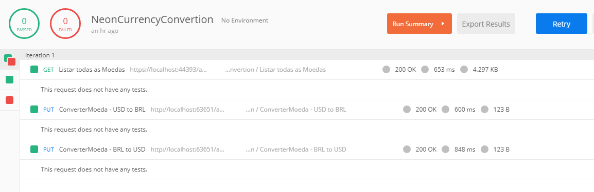

# CurrencyConvertion

Project to provide currency conversion in real time. (Interview teste Neon).

## Technologies

* [.NET Core 2.2.1](https://dotnet.microsoft.com/download)
* [C# 7.3](https://docs.microsoft.com/en-us/dotnet/csharp)
* [ASP.NET Core 2.2.1](https://docs.microsoft.com/en-us/aspnet/core)
* [Angular 7.2.4](https://angular.io/docs)
* [Typescript 3.2.4](https://www.typescriptlang.org/docs/home.html)
* [HTML](https://www.w3schools.com/html)
* [CSS](https://www.w3schools.com/css)
* [Swagger](https://swagger.io)
* [Docker](https://docs.docker.com)
* [Moq](https://github.com/Moq/moq4/wiki/Quickstart)
* [FluentValidation](https://fluentvalidation.net/)
* [MediatR](https://github.com/jbogard/MediatR)
* [DryIoC](https://github.com/dadhi/DryIoc)

## Practices

* Hexagonal Architecture
* Clean Code
* Code Analysis
* SOLID Principles
* DRY Principle (Don't repeat yourself)
* Ubiquitous Language
* Dependency Injection

## Tools

* [Visual Studio 2017](https://visualstudio.microsoft.com/vs)
* [Visual Studio Code](https://code.visualstudio.com)
* [Postman](https://www.getpostman.com)

## Visual Studio Extensions

* [CodeMaid](https://marketplace.visualstudio.com/items?itemName=SteveCadwallader.CodeMaid)
* [Roslynator](https://marketplace.visualstudio.com/items?itemName=josefpihrt.Roslynator2017)
* [SonarLint](https://marketplace.visualstudio.com/items?itemName=SonarSource.SonarLintforVisualStudio2017)
* [TSLint](https://marketplace.visualstudio.com/items?itemName=vladeck.TSLint)

## Layers

## Angular

## Swagger

## Postman Collection

## Run API Command Line

1. Install latest [.NET Core SDK](https://aka.ms/dotnet-download).

2. Open directory **src\Adapters\ConversorMoeda.WebApi** in command line and execute **npm run restore**.

3. On direcotry **src\Adapters\ConversorMoeda.WebApi** in command line and execute **dotnet run**.

4. Open <http://localhost:5001>.

## Run API Visual Studio 2017

1. Install latest [.NET Core SDK](https://aka.ms/dotnet-download).

3. Open **Neon.ConversorMoeda.sln** in Visual Studio.

4. Set **ConversorMoeda.Application.csproj** as startup project.

5. Press **F5**.

## Run Angular Command Line

1. Install latest [NPM](https://www.npmjs.com/get-npm).

2. Open directory **src\FrontEnd** in command line and execute **npm install**.

3. On the directory **source\Frontend** execute **ng serve**.

4. Open <http://localhost:4200>.

## Run Docker

1. Install and configure [Docker](https://www.docker.com/get-started).

2. Execute **docker-compose up --build -d --force-recreate** in root directory.

3. Open <http://localhost:44393>.
